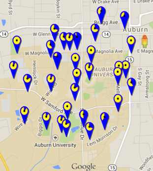

# Datafest-Ipark

##### `An parking app, to reduce the chaos behind football game day parking，decrease traffic and increase the enjoyment of the game day experience`

## Overview


Our hope is that by providing information about the availability of parking in the different lots around campus, we can decrease traffic and increase the enjoyment of the game day experience. Our app is based on the Google Maps API. We have implemented a system where the user can log into our website and check how full a particular parking lot is by checking the map. Further, the user can reserve a spot on the map to indicate they have parked in the lot. The users can also map a route to where they are trying to go. We would like to implement an algorithm to predict the amount of spaces taken by people either not using the app or who have not updated their information. Overall, we  are trying to use information to combat the parking issues.

The parking app was written by current Computer Science and Eletrical Engineering students at Auburn University. Our back end part is written in the Scala functional programming language, while our frontend is by Html and javascripts. 

## Back End Feature
The back end service is implemented by Play Framework with Scala language. There are several features under the back end system:

* It builds web applications in the built-in `JBoss Netty` web server.
* Asynchronized response is supported in our system. Play framework only uses a fixed thread pool to process requests, and suspended the request till thread is available.



## Install and Run

```
$ sbt
> run
$ open http://localhost:9000
```


## Front End Feature
